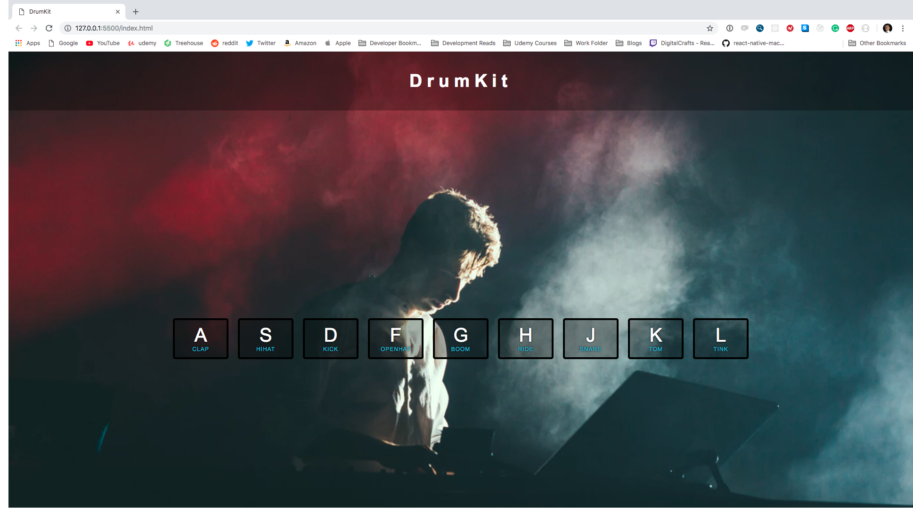

# Vanilla Javascript project that use keyboard key to play drumkit sounds. 

* keyCode items and all the associated numbers with the keyboard keys. 
* Timeout function in order to create a style change that only last for a millisecond. 

### Screenshots
